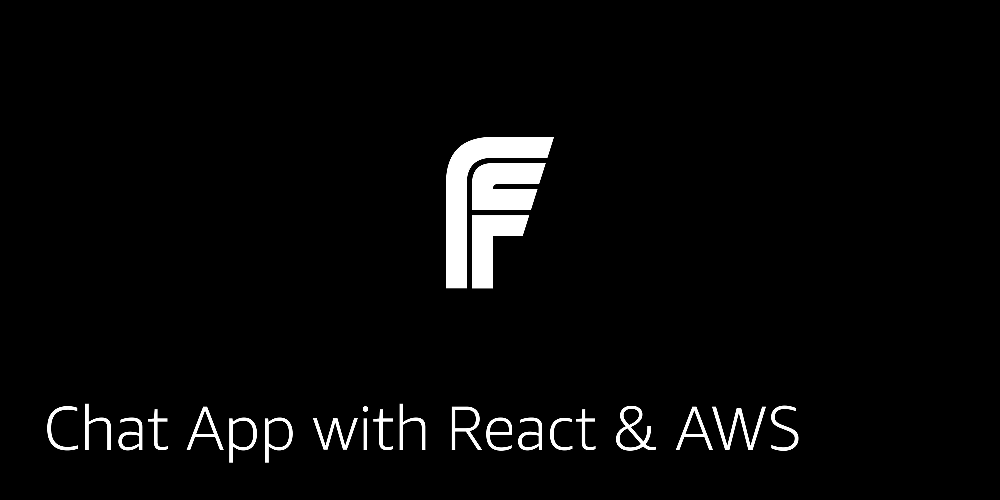

## Real Time Chat with React, GraphQL, and AWS AppSync

This application can be deployed with either AWS Amplify or CDK.

### Deploying with AWS Amplify

1. Clone the repo and change into the directory:

```sh
git clone https://github.com/full-stack-serverless/react-chat-app-aws.git

cd react-chat-app-aws
```

2. Install the dependencies:

```sh
npm install 

# or

yarn
```

3. Deploy the back end

```sh
amplify init

# walk through steps

amplify push
```

4. Start the app

```sh
npm start
```

### Deploying with CDK

To deploy with CDK, follow the steps [here](https://github.com/full-stack-serverless/cdk-appsync-chat)